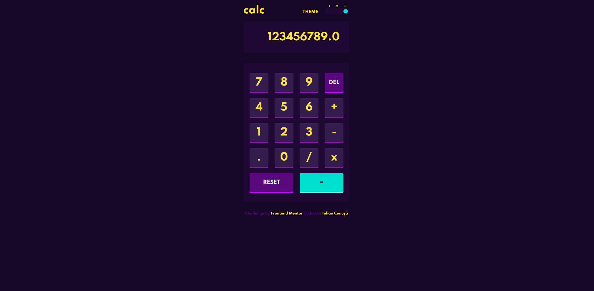

# Frontend Mentor - Calculator app solution

This is a solution to the [Calculator app challenge on Frontend Mentor](https://www.frontendmentor.io/challenges/calculator-app-9lteq5N29). Frontend Mentor challenges help you improve your coding skills by building realistic projects. 

## Table of contents

- [Overview](#overview)
  - [The challenge](#the-challenge)
  - [Screenshot](#screenshot)
  - [Links](#links)
- [My process](#my-process)
  - [Built with](#built-with)
  - [What I learned](#what-i-learned)
  - [Continued development](#continued-development)
  - [Useful resources](#useful-resources)
- [Author](#author)
- [Acknowledgments](#acknowledgments)

**Note: Delete this note and update the table of contents based on what sections you keep.**

## Overview

### The challenge

Users should be able to:

- See the size of the elements adjust based on their device's screen size
- Perform mathmatical operations like addition, subtraction, multiplication, and division
- Adjust the color theme based on their preference
- **Bonus**: Have their initial theme preference checked using `prefers-color-scheme` and have any additional changes saved in the browser

### Screenshot

### Links

- Solution URL: [GitHub](https://github.com/iulian-cenusa/frontend-mentor-calculator-app)
- Live Site URL: [GitHub Pages](https://iulian-cenusa.github.io/frontend-mentor-calculator-app/)

## My process

### Built with

- Semantic HTML5 markup
- CSS custom properties
- Flexbox
- CSS Grid

### What I learned

This project was fun to complete. It taught me a lot about how to create themes on web pages and also I gain experience on backend ( javaScript ) by doing all the logic behind. Also I learn to use local storage feature of browsers in order to store the prefered theme and on page refresh it should remain selected.

### Continued development

This project is 99.99% complete. Though it can be improved on backend ( calculator operations or complex operations ) and frontend ( more accurate to design files ).

### Useful resources

- [Box Shadow Css Generator](https://html-css-js.com/css/generator/box-shadow/) - This helped me with generating the correct box shadow for calculator keypad.
- [Storage - Web APIs | MDN](https://developer.mozilla.org/en-US/docs/Web/API/Storage) - This helped me understanding local storage feature of browsers and how to use it in JS.

## Author

- Frontend Mentor - [@iulian-cenusa](https://www.frontendmentor.io/profile/iulian-cenusa)
- Twitter - [@IulianCenusa](https://twitter.com/IulianCenusa)
- Other Projects - [Bitbucket Repo](https://bitbucket.org/iulian_cenusa/)

## Acknowledgments

For finishing this project I must acknowledge [Rita Doumet](https://www.frontendmentor.io/profile/ritadoumet) as I was inspired by her solution regarding the theme toggle element.
